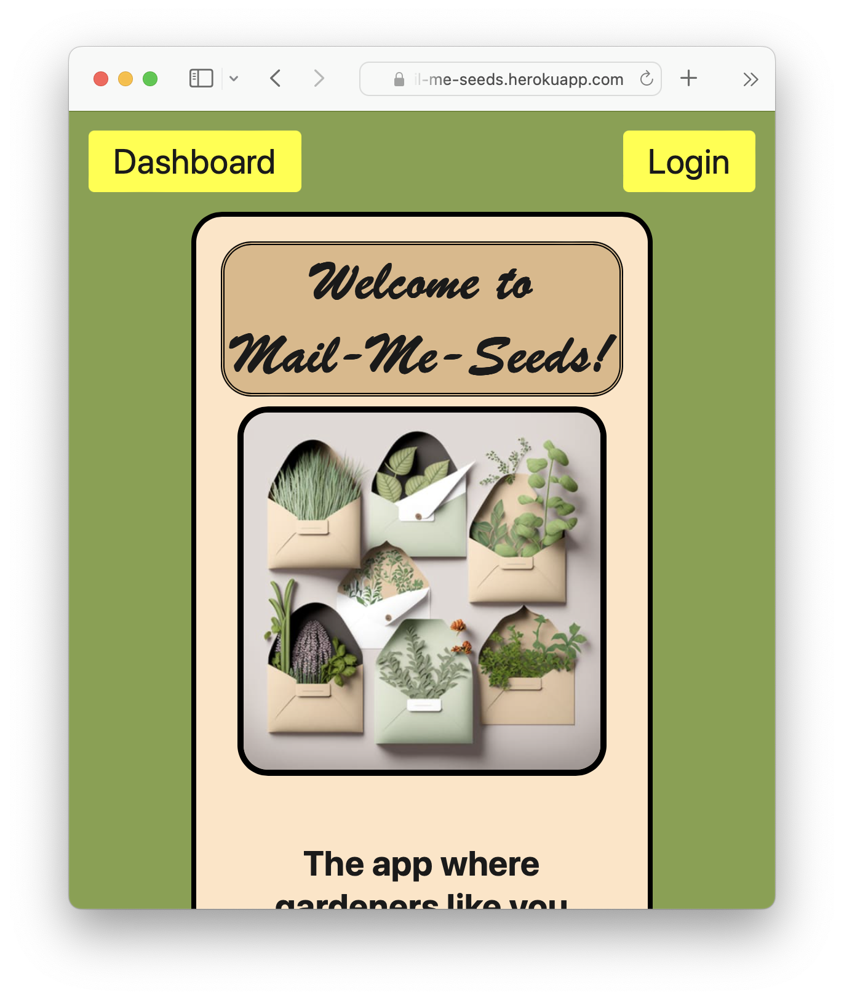

# Mail-Me-Seeds

## Table of Contents

[Description](#description)

[Usage](#usage)

[Deployed](#deployed)

[License](#license)

[Contributing](#contributing)

[Questions](#questions)

## Description

### Mail-Me-Seeds is a social resource sharing app for gardeners. 
Users create a profile that includes the climate hardiness zone where their garden is located, which vegetable or flower
seed varieties they have extras of to share, and which types of seeds they would be interested in
receiving for free in the mail (For example, English Cucumbers, Heirloom Tomatoes, and Lupines). Users receive a list of recipient addresses when enough other gardeners have expressed interest in seeds that user is offering. Users can leave positive feedback for other users when they successfully receive and germinate seeds.

## Usage

This program is deployed to the web and can be accessed by any web browser. To get full functionality you will have to sign up for an account, but it requires no installation or set up.

## Deployed
You can access our site [here](https://mail-me-seeds.herokuapp.com)!

## Going Forward
- We aim to allow for climate regions to be included in seed offers, and to add the ability to search seeds available for the users climate region. 
- We would love to eventually expand to include user home pages, and seed offer commenting to gauge potential quality of offers.

## License

See MIT licence included in repo.

## Contributing to this project:
We would love additional collaboration on this project. Feel free to fork the repo and send us pull requests, or reach out to us at the email listed below.

## Questions?

### Find us on GitHub at : <https://github.com/TheBluWiz>

### We are Jamey Wicklund (TheBlueWiz), Kyle F.(MrSinzo) Hoon Kim (hkim84), and Rhys Smoker (Noctiluca-scintillans)

### Or contact us at mail.me.seeds@gmail.com if you have any further questions.
